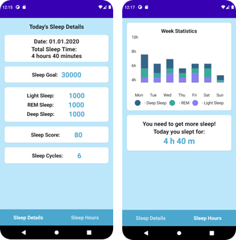

[![Contributors][contributors-shield]][contributors-url]
[![Forks][forks-shield]][forks-url]
[![Stargazers][stars-shield]][stars-url]
[![Issues][issues-shield]][issues-url]
[![MIT License][license-shield]][license-url]
[![LinkedIn][linkedin-shield]][linkedin-url]

<br />
<div align="center">
  <h3 align="center">Polar Sleep Tracker Mobile App</h3>

  <p align="center">
    <br />
    <a href="https://github.com/Din2Polar/PolarDemo.git"><strong>Explore the docs »</strong></a>
    <br />
    <br />
    <a href="https://alikikap.github.io/wolt-delivery-calculator/">View Demo</a>
    ·
    <a href="https://github.com/Din2Polar/PolarDemo/issues">Report Bug</a>
    ·
    <a href="https://github.com/Din2Polar/PolarDemo/issues">Request Feature</a>
  </p>
</div>
<div align="center">

</div>
## Table of contents
1. [About The Project](#about-the-project)
    * [Task](#task)
    * [Built With](#built-with)
2. [Installation](#installation)
3. [Usage](#usage)
4. [License](#license)
5. [Contact](#contact)
## About The Project

This project was a task from the Polar company where we were asked to implement a data retrieving mobile app. We were using the smartwatch provided from "Polar" and created a demo app that takes sleep data from user's smartwatch and makes statistics in charts based on that.  
### Task
* Create access to Polar ACCESSLINK API
* Enable the user consent for data access
* Retrieve selected data to the mobile app
* Instructions: Polar Accesslink github
* Requires: API integration, mobile development
### Built With
* 
* 
<p align="right">(<a href="#readme-top">back to top</a>)</p>

## Installation

Follow these steps to get the project up and running on your local machine:
<br/>
Clone the repository:
```bash
  git clone https://github.com/Din2Polar/PolarDemo.git
```
Navigate to the project directory:
```bash
  cd PolarDemo
```
## Usage
Open Android Studio.
Click the "Sync Now" button in Android Studio to sync your Gradle files. This will download the Compose libraries.
To run your app, click the "Run" button in Android Studio and select your target device or emulator.
## License

Distributed under the MIT License. See `LICENSE.txt` for more information.

<p align="right">(<a href="#readme-top">back to top</a>)</p>

## Contact

Aliki Kapasakalidi - [@AlikiKap](https://www.linkedin.com/in/aliki-kapasakalidi-921891203/) - aliki02.kapasakalidi@gmail.com

Danila Timoschenko - https://github.com/jazzman1825

Project Link: [https://github.com/Din2Polar/PolarDemo.git](https://github.com/Din2Polar/PolarDemo.git)

<p align="right">(<a href="#readme-top">back to top</a>)</p>


[contributors-shield]: https://img.shields.io/github/contributors/AlikiKap/wolt-delivery-calculator.svg?style=for-the-badge
[contributors-url]: https://github.com/Din2Polar/PolarDemo/graphs/contributors
[forks-shield]: https://img.shields.io/github/forks/Din2Polar/PolarDemo.svg?style=for-the-badge
[forks-url]: https://github.com/Din2Polar/PolarDemo/network/members
[stars-shield]: https://img.shields.io/github/stars/Din2Polar/PolarDemo.svg?style=for-the-badge
[stars-url]: https://github.com/Din2Polar/PolarDemo/stargazers
[issues-shield]: https://img.shields.io/github/issues/Din2Polar/PolarDemo.svg?style=for-the-badge
[issues-url]: https://github.com/Din2Polar/PolarDemo/issues
[license-shield]: https://img.shields.io/github/license/Din2Polar/PolarDemo.svg?style=for-the-badge
[license-url]: https://github.com/Din2Polar/PolarDemo/blob/main/LICENSE
[linkedin-shield]: https://img.shields.io/badge/-LinkedIn-black.svg?style=for-the-badge&logo=linkedin&colorB=555
[linkedin-url]: https://www.linkedin.com/in/aliki-kapasakalidi-921891203/
[React.js]: https://img.shields.io/badge/React-20232A?style=for-the-badge&logo=react&logoColor=61DAFB
[React-url]: https://reactjs.org/